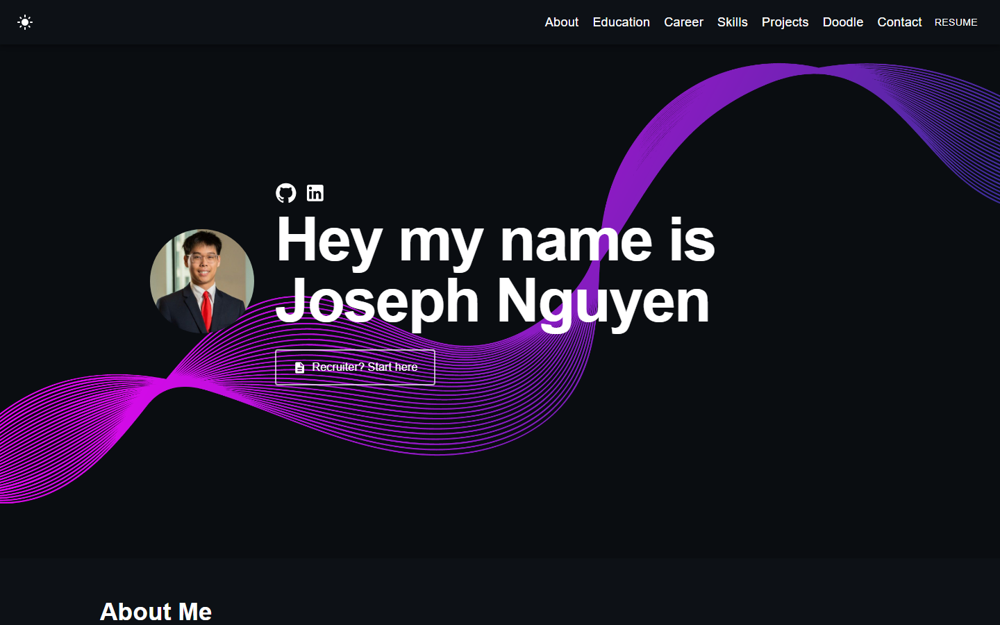

# Joseph Nguyen — Portfolio

My personal portfolio site. Business Information Technology student at Virginia Tech, building things in data, tech risk, and product.

**[View the live site →](https://josephnguyen010-prog.github.io/Joseph-Nguyen-Portfolio)**



## What's on it

| Section | |
|---|---|
| **About** | Short bio and an auto-advancing photo carousel with a full-size lightbox |
| **Education** | Virginia Tech, BBA in Business Information Technology (Decision Support Systems) — plus a playable HokieBird runner tucked into the card |
| **Career** | Vertical timeline of roles, from Venus to RSM |
| **Skills** | Data & analytics, business analysis & tech risk, product & engineering |
| **Projects** | Selected work with live links |
| **Doodle** | A drawing canvas — draw something and send it straight to my inbox |
| **Contact** | Message form wired to real email delivery |

Dark and light modes, responsive down to mobile, and every animation respects `prefers-reduced-motion`.

## Built with

    

React 18 + TypeScript on Create React App, styled with SCSS and MUI. The contact form and doodle sender run on [EmailJS](https://www.emailjs.com/), with doodle images hosted on [Cloudinary](https://cloudinary.com/). Deployed to GitHub Pages via `gh-pages`.

## Running it locally

```bash
npm install
npm start
```

Then open [http://localhost:3000](http://localhost:3000).

The contact form and doodle sender need credentials to actually deliver mail. Copy `.env.example` to `.env.local` and fill in the values — that file documents where each one comes from and how to lock it down:

```bash
cp .env.example .env.local
```

Without them the site runs fine; the send buttons just fall back to a mailto link. Restart `npm start` after editing `.env.local`.

Tests:

```bash
npm test
```

## Deploying

`.env.local` is gitignored, so the keys are only baked in when I build locally:

```bash
npm run deploy
```

That builds and pushes to the `gh-pages` branch, publishing to the `homepage` URL in [package.json](package.json).

## Credits

Built on the [react-portfolio-template](https://github.com/yujisatojr/react-portfolio-template) by [@yujisatojr](https://github.com/yujisatojr), MIT licensed. The layout has since been rebuilt substantially, but the original scaffolding was a great starting point.
